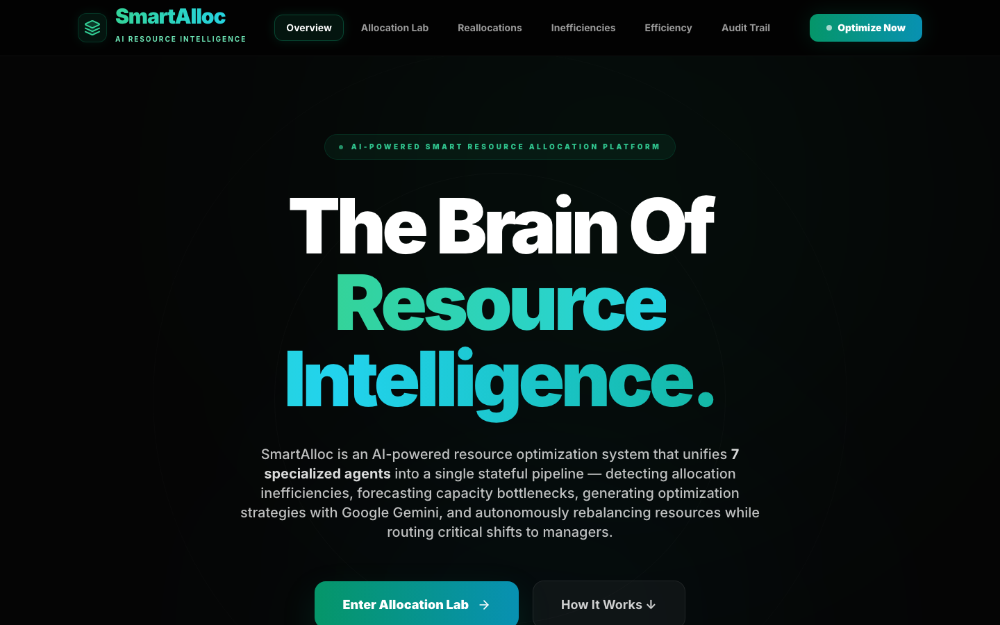
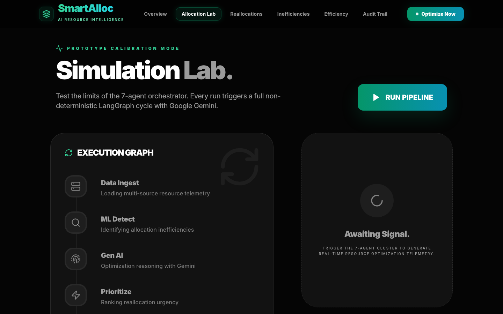
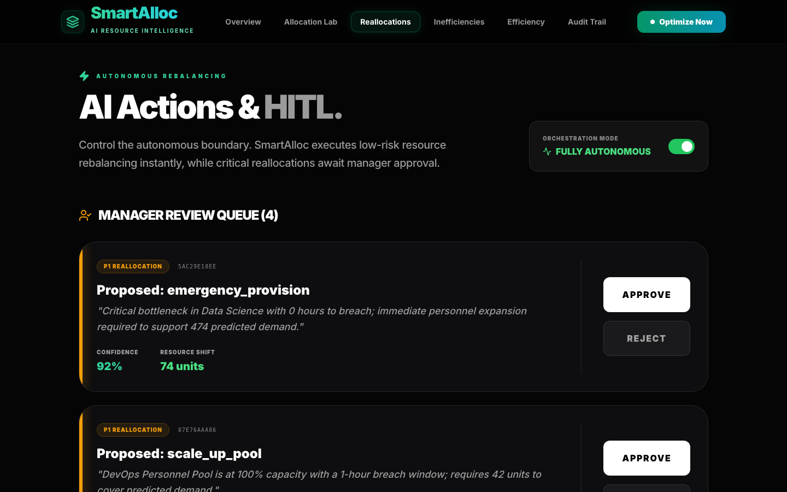
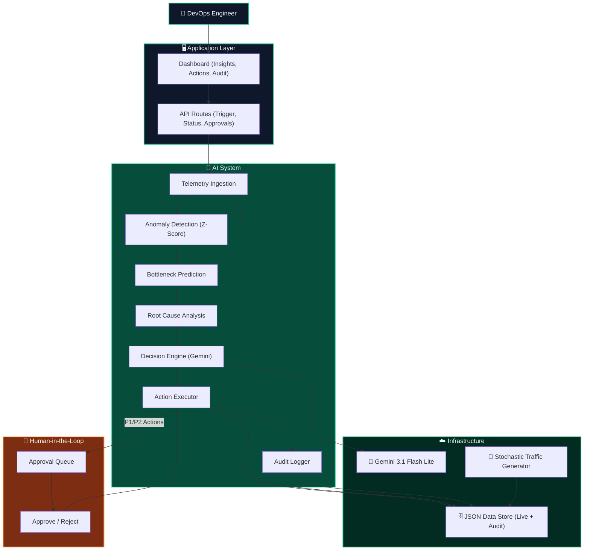
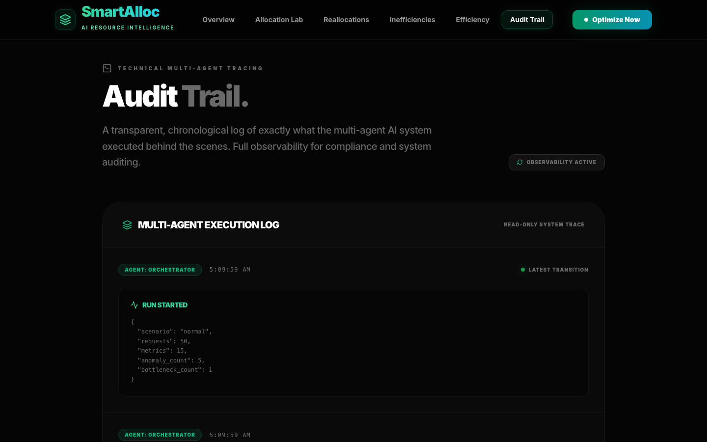
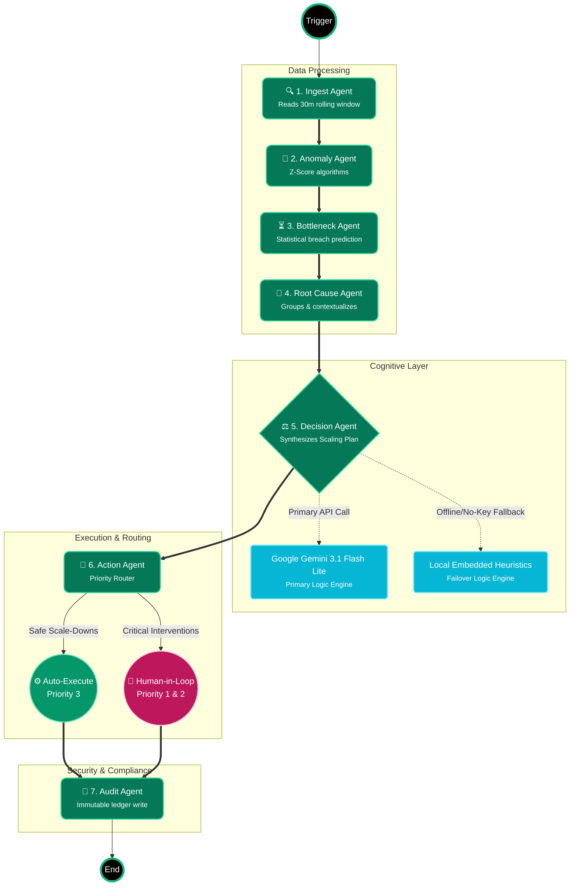
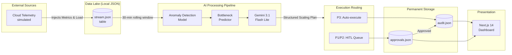
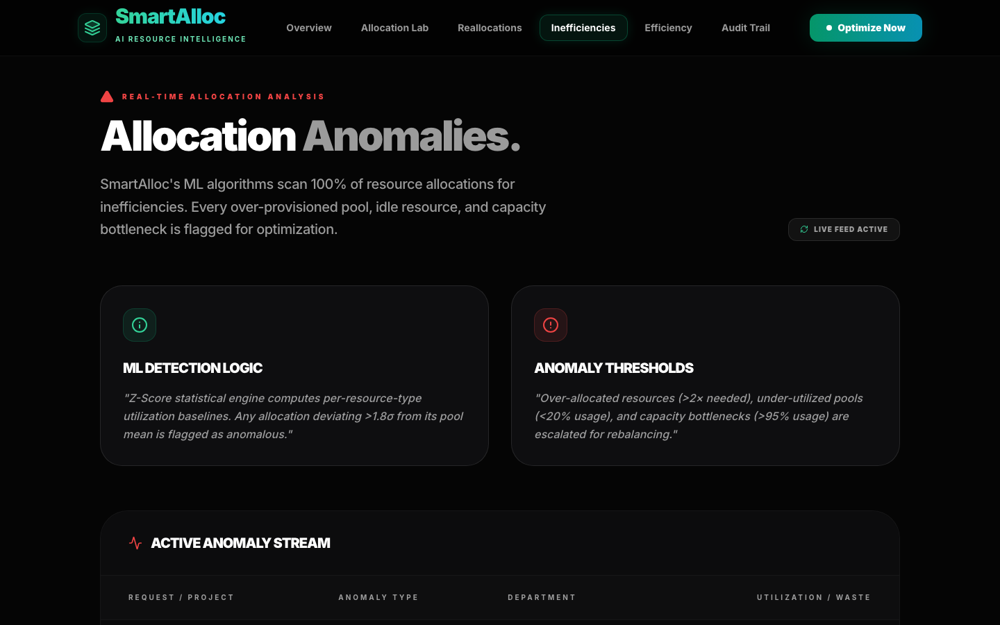
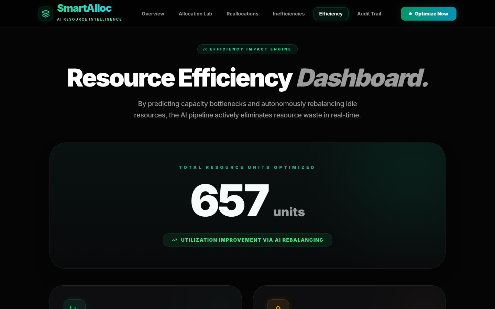

</div>

---

<div align="center">
  <h1>⚡ SmartAlloc</h1>
  <p><b>Enterprise Resource Intelligence & Autonomous Allocation</b></p>
  <p><i>A 7-agent AI pipeline that watches enterprise cloud, compute, and personnel resources 24/7, catches inefficiencies before bottlenecks occur, and acts autonomously — with a human always in the loop for high-stakes decisions.</i></p>

  <br />
  <div style="display: flex; justify-content: center; gap: 10px; margin-bottom: 10px;">
    <a href="https://smartalloc-369307850248.us-central1.run.app/">
      
    </a>
    <a href="https://smart-alloc.vercel.app/">
      
    </a>
  </div>
  <p><b>☁️ Deployed on Google Cloud:</b> <a href="https://smartalloc-369307850248.us-central1.run.app/">smartalloc-369307850248.us-central1.run.app</a></p>
  <p><b>🚀 Deployed on Vercel:</b> <a href="https://smart-alloc.vercel.app/">smart-alloc.vercel.app</a></p>
  <br />

  [](https://www.typescriptlang.org/)
  [](https://nextjs.org/)
  [](https://aistudio.google.com/)
  []()
  [](https://langchain-ai.github.io/langgraphjs/)
</div>

---

<br />

> 📸 **Dashboard Overview:** Executive Summary with live allocation metrics.
> 

## Table of Contents

- [The Problem — Why This Exists](#the-problem--why-this-exists)
- [What SmartAlloc Does — Solution Overview](#what-smartalloc-does--solution-overview)
- [Key Features — Full Feature List](#key-features--full-feature-list)
- [Architecture — Full System Architecture](#architecture--full-system-architecture)
- [The 7-Agent Pipeline — Deep Dive](#the-7-agent-pipeline--deep-dive)
- [Data Flow Diagram (DFD)](#data-flow-diagram-dfd)
- [Tech Stack — Full Table](#tech-stack--full-table)
- [Project File Structure](#project-file-structure)
- [Simulation Scenarios](#simulation-scenarios)
- [Infrastructure Setup](#infrastructure-setup)
- [The Prototype vs. Full Production System](#the-prototype-vs-full-production-system)
- [The Efficiency Impact Model](#the-efficiency-impact-model)
- [Setup & Installation](#setup--installation)
- [Environment Variables Reference](#environment-variables-reference)
- [Dashboard Pages](#dashboard-pages)
- [API Reference](#api-reference)
- [How to Add a New Scenario](#how-to-add-a-new-scenario)
- [Contributing & License](#contributing--license)
- [Acknowledgements](#acknowledgements)

---

## The Problem — Why This Exists

Imagine you are the VP of Engineering or CTO of a mid-to-large tech enterprise provisioning thousands of compute hours and managing massive cloud budgets. Your DevOps team reviews resource allocations manually — across multiple AWS/GCP clusters, Kubernetes namespaces, and internal team assignments. They check for over-provisioned databases, idle GPU instances, and duplicate service deployments. On a good day, they catch about 60% of the inefficiencies. But here is the problem: **by the time a human analyst spots an idle GPU or an over-allocated server, the compute waste has already occurred — typically over several weeks.** 

The resource leakage is silent, continuous, and compounding.

Industry data shows that tech enterprises waste between **30% to 40%** of their annual cloud and compute infrastructure spend due to undetected overallocation. This includes idle staging environments, unoptimized scaling groups, and orphaned storage volumes. On a `$10M` infrastructure budget, 30% leakage translates to **$3M per year walking out silently in compute waste**.

Additionally, SLA breaches for critical services carry severe user-impact and latency penalties. Most SLA latency breaches are entirely predictable based on CPU/Memory volume, incoming traffic, and scaling history. Yet no team prevents them proactively because there is no tool that combines real-time compute analysis with predictive statistical modelling.

> **The Critical Gap:** No existing tool combines compute anomaly detection + latency/SLA breach prediction + autonomous scaling action + full audit trail in a single unified pipeline. SmartAlloc unifies these capabilities into an AI-orchestrated system that runs continuously, acts autonomously on safe scale-downs, and holds high-impact scale-ups for human review.

---

## What SmartAlloc Does — Solution Overview

SmartAlloc is an autonomous AI agent system. It is not just a dashboard showing usage charts; it is an active participant in your enterprise infrastructure operations that detects resource bottlenecks, reasons about scaling, takes corrective reallocation action, and writes a complete audit trail in under **3 seconds** per execution cycle.

1. **Ingests Data:** Continuously reads compute metrics, active instances, and SLA tickets from a Local JSON stream (mocking a live telemetry feed like Datadog or Kubernetes metrics).
2. **Detects Anomalies:** Scans 100% of telemetry through a statistical isolation algorithm to identify CPU under-utilization, memory leaks, and orphaned instances.
3. **Predicts Bottlenecks:** Forecasts which services will breach their SLA latency constraints before it happens using traffic and load metrics.
4. **Reasons & Synthesizes:** Passes findings to Google Gemini's **Gemini 3.1 Flash Lite** LLM, which synthesizes the raw data into a structured reallocation plan.
5. **Executes Autonomously:** Executes routine P3 actions (spinning down idle dev instances, reclaiming orphaned storage) instantly.
6. **Requires Human Approval:** Routes critical P1 and P2 actions (resizing production databases, cross-region failovers) to a human-in-the-loop approval queue.
7. **Maintains Compliance:** Logs every single scale action to an immutable Local JSON audit trail.

> 📸 **Live Activity Feed:** Dynamic timeline showing AI agent scaling events in real-time.
> 

---

## Key Features — Full Feature List

### 1. 7-Agent LangGraph.js Pipeline
The core of SmartAlloc is a stateful multi-agent pipeline: `Ingest → Anomaly → Bottleneck → RootCause → Decision → Action → Audit`. Each agent has a single, testable responsibility. LangGraph.js manages a persistent, typed state object that flows through every node, giving the final Audit agent full visibility into what every upstream agent decided and why.

### 2. Dynamic Scenario Simulator & LP Optimization Sliders
The **Simulation Lab** features an interactive UI where users can adjust **Available Budget** and **Market Demand** via sliders. Underneath, a dynamic **Linear Programming (LP) Approximation** layer recalculates the optimal resource split between Operations (to protect SLAs), Marketing (for growth), and R&D (for innovation). It also ships with 6 stochastic enterprise workload profiles (`peak_sprint`, `quarter_end`, etc.).

> 📸 **Simulation Lab:** Real-time pipeline execution and LP optimization.
> 

### 3. SmartAlloc AI Co-Pilot (Chatbot)
A highly intelligent, domain-specific AI chatbot floating in the UI. Powered by Google Gemini 3.1 Flash Lite, it strictly acts as a **Financial and Resource Allocation Assistant**. You can ask it natural language questions (e.g., "How should I allocate my budget next month?") and it provides context-aware, conversational advisory strictly constrained to enterprise finance and operations.

### 4. Google Gemini Reasoning (Gemini 3.1 Flash Lite + Local Fallback)
The Decision Agent uses `gemini-3.1-flash-lite-preview` via the Gemini API to synthesize ML findings into a structured JSON reallocation plan. If Gemini 3.1 Flash Lite fails (timeout, rate limit, no API key), the pipeline automatically falls back to an intelligent local heuristic simulation. **The pipeline never halts.**

### 5. Statistical Anomaly Detection
Uses statistical methods inspired by Isolation Forest principles. Detects three types of anomalies: `over_allocated`, `under_utilized`, and `bottleneck`. Each anomaly receives a dynamic severity score based on the Z-score deviation from the resource baseline.

### 6. SLA Breach Prediction
Performs statistical bottleneck prediction combining metrics like node capacity, current request volume, time-of-day, and service priority. Calculates a breach probability for every active cluster, shifting from a reactive "wait for pagerduty" model to a proactive "auto-scale to prevent downtime" stance.

### 7. Human-in-the-Loop (HITL) Workflow
Implements a three-tier priority system:
* **P1:** Critical (Prod DB Resizing, Multi-Region Shift) — Immediate human review.
* **P2:** Significant (Adding GPU nodes, Team Reassignments) — Human review within 24h.
* **P3:** Routine (Stopping idle instances, clearing caches) — Auto-executes instantly.

> 📸 **Recommended Actions Dashboard:** Pending P1 approvals and executed actions.
> 

### 8. Immutable Audit Trail
Every pipeline run and agent decision is written to the `audit.json` local storage table containing the `run_id`, agent name, full JSON payload, and timestamps. This satisfies enterprise compliance and infrastructure tracing.

> 📸 **Technical Audit Trail:** Expandable traces for every pipeline run.
> 

### 9. Local-First Architecture
Fully local stack optimized for ultra-fast hackathon demonstrations and zero-config deployment on **Vercel**.
* **Compute**: Next.js 14 Serverless Functions
* **Storage**: Vercel `/tmp` compatible Local Filesystem 
* **Database**: Local JSON Storage (`stream.json`, `audit.json`, `approvals.json`)
* **Intelligence**: Google Gemini (Gemini 3.1 Flash Lite) + Local Rule-based Fallback
* **Security**: Zero AWS credentials required, completely standalone.

---

## 🧠 1. Core System Architecture

The **SmartAlloc** platform is designed as a highly cohesive, concurrently executing web application. By fundamentally decoupling the UI presentation layer from the deep AI-orchestration layer, the platform guarantees that intense machine-learning workloads never block or degrade the user experience.

### Architectural Tiers

1.  **Presentation & API Layer (Next.js 14 App Router):**
    Handles static asset delivery, server-side dynamic rendering (`React Server Components`), and exposes lightweight asynchronous API endpoints (`/api/runs`, `/api/approve`). This layer is styled heavily with `Vanilla CSS` and `Framer Motion` for high-fidelity interactive elements, seamlessly providing a polished interface for human oversight.
2.  **Stateful Persistence Layer (Local JSON Storage):**
    The system requires ultra-low latency for agent state tracking and high durability for final reports. 
    * **Local JSON Storage**: Managed via `stream.json`, `approvals.json`, and `audit.json` for structured state.
    * **File System Vault**: Acts as the long-term vault for full-fidelity JSON trace payloads.
3.  **Intelligence Layer (Google Gemini Models):**
    All cognitive processing routes through the native Gemini API. For reasoning tasks, the system deploys **Gemini 3.1 Flash Lite** (primary) and an embedded **Local Simulator Fallback**. Access requires only a standard `GEMINI_API_KEY`.




---

## The 7-Agent Pipeline — Deep Dive

Each agent in the SmartAlloc pipeline is a pure function that updates a shared LangGraph state block. By breaking down the analysis process into 7 distinct cognitive steps, the system achieves perfect determinism: if the LLM makes a mistake, the exact input and reasoning state is captured in the isolated node block for review.

| Agent | Responsibility | Input | Output | Failure Mode |
|---|---|---|---|---|
| **INGEST** | Reads live window from telemetry streams | `window_minutes` config | Raw metrics + nodes array | Falls back to last successful window |
| **ANOMALY** | Runs statistical detection across compute nodes | Raw metrics | Anomaly findings (over/under allocation) | Rule-based baseline (Z-Score fallback) |
| **BOTTLENECK**| Predicts SLA latency breach probability | Traffic volume | Breach risk list | Rule-based fallback (capacity threshold) |
| **ROOT_CAUSE** | Classifies anomalies | Anomaly findings | Classified findings (idle/leak/spike) | Uses top severity factor |
| **DECISION** | Synthesizes action plan via Gemini 3.1 Flash Lite | All findings | JSON action plan (P1/P2/P3) | **Local Offline Fallback Engine** |
| **ACTION** | Routes P3 to auto-scale, P1/P2 to DB | Action plan | Executed actions + pending queue | Logs failure, continues pipeline |
| **AUDIT** | Writes complete immutable event record | Full run state | Immutable audit entry | Retries 3× before failure |

---

## ⚙️ LangGraph Autonomous State Machine Flow

While the System Architecture dictates the *infrastructure*, the **LangGraph Orchestration Flow** controls the *cognitive logic*. 

The orchestration pipeline is not a linear script; it is a cyclic, state-driven Graph built on `LangGraph.js`. The state machine marshals an immutable context object (containing `telemetry`, `anomalies`, `actions`, and `approvals`) across seven discrete nodes.

### How State is Compiled and Passed
1.  **Node Execution:** An agent (e.g., the `AnomalyDetector`) receives the current state, executes its isolation algorithms, and appends its findings (like Z-score identified bottleneck points) back to the state object.
2.  **Conditional Routing:** Edges between nodes dictate logic. For example, if the `DecisionEngine` determines a scale-up is a `P1` (critical threshold) requiring human oversight, the graph conditionally routes to the `Approval Queue` node instead of immediately executing.
3.  **State Preservation:** The final payload represents a deterministic ledger of the complete run, tracking exactly which model provided which rationalization.

> 📸 **Trace Telemetry:** Expanding the raw JSON payload of a single autonomous graph transition.
> 



---

## Data Flow Diagram (DFD)



---

## Tech Stack — Full Table

| Layer | Technology | Version | Why This Choice |
|---|---|---|---|
| Frontend Framework | Next.js | 14.2.15 | App Router, Server Components, API routes in one repo |
| Language | TypeScript | 5.x | Type safety across agents, state, and API calls |
| UI Components | React | 18.3 | Concurrent rendering for live feed updates |
| Animations | Framer Motion | 11.11 | Smooth metric transitions during live pipeline runs |
| Charts | Recharts | 2.13 | Resource waterfall and time-series charts |
| Styling | Tailwind CSS | 3.4 | Utility-first, customized Neon Green / Emerald theme |
| Agent Orchestration | LangGraph.js | 0.2.19 | Stateful multi-agent graphs with conditional routing |
| LLM Reasoning | Google Gemini 3.1 Flash Lite | v1alpha | Optimized for ultra-fast, structured Gen AI recommendations |
| LLM Fallback | Embedded Heuristic Engine | Local | Automatic failover — demo never stops even offline |
| Storage | Vercel `/tmp` Compatible FS | Native | Persistent storage for JSON audit reports |
| Database | Local JSON File System | Native | Zero-dependency, zero-setup data layer |
| Mock Data | Custom Stochastic Simulator | Local | Realistic node scaling, CPU load, and capacity spikes |

---

## Project File Structure

```text
SmartAlloc/
├── src/                              # Main application source code
│   ├── app/                          # Next.js 14 App Router routes
│   │   ├── layout.tsx                # Root layout / GlobalNav wrapper
│   │   ├── page.tsx                  # / — Full Overview dashboard
│   │   ├── simulation/page.tsx       # /simulation — Sim Lab pipeline trigger
│   │   ├── actions/page.tsx          # /actions — Execution & HITL actions
│   │   ├── anomalies/page.tsx        # /anomalies — Risks & Analysis feed
│   │   ├── sla/page.tsx              # /sla — Impact / Efficiency page
│   │   ├── audit/page.tsx            # /audit — Technical trace logging
│   │   └── api/                      # Next.js specific serverless API routes
│   │       ├── pipeline/route.ts     # Triggers AI simulation + LangGraph agents
│   │       ├── approve/route.ts      # HITL approval mechanics
│   │       ├── runs/route.ts         # Pipeline execution history
│   │       ├── metrics/[id]/route.ts # Mathematical KPIs
│   │       ├── audit/[id]/route.ts   # Deep trace retrieval
│   │       └── status/route.ts       # Live system polling
│   │
│   ├── components/                   # React UI presentational components
│   │   └── GlobalNav.tsx             # Navbar with gradient neon branding
│   │
│   ├── ai_agents/                    # LangGraph.js pipeline logic
│   │   ├── orchestrator.ts           # Wires the graph and conditional routing
│   │   ├── state.ts                  # Shared pipeline state schema
│   │   └── nodes.ts                  # Logic for all 7 independent agents
│   │
│   ├── synthetic_data_engine/
│   │   └── simulator.ts              # 6-scenario engine driving telemetry
│   │
│   ├── services/                     # Backend local services
│   │   ├── db.ts                     # Local JSON database wrapper
│   │   ├── gemini.ts                 # Google Gemini Flash Lite integration
│   │   └── storage.ts                # File system persistence
│   │
│   └── lib/                          # App utilities
│       └── formatters.ts             # Value formatting logic
│
├── docs/screenshots/                 # README demonstration imagery
├── .env.example                      # Environment variables template
├── next.config.js                    # Next.js routing config
├── package.json                      # NPM dependencies
├── tailwind.config.js                # Tailwind CSS styling and theme
└── tsconfig.json                     # TypeScript compiler configuration
```

---

## Simulation Scenarios

The active scenario is chosen purely dynamically per run to stress-test the pipeline under different infrastructure stressors. 

| Scenario | Description | Anomaly Rate | Breach Rate | Team Capacity | Spike Multiplier |
|---|---|---|---|---|---|
| `normal` | Routine day, low traffic. Validates baseline operations. | 4% | 20% | 80% | 3–6× |
| `peak_sprint` | Heavy engineering merge day. Tests CI/CD pipeline compute limits. | 12% | 28% | 75% | 5–15× |
| `team_scaling` | Onboarding influx. Simulates over-assigned access. | 3% | 55% | 45% | 2–5× |
| `cloud_migration` | Massive data shifts. Tests storage and IOPS bottlenecks. | 9% | 35% | 70% | 2–4× |
| `product_launch` | High-traffic Go-To-Market surge. GPU/CPU spiking test. | 15% | 42% | 60% | 4–10× |
| `quarter_end` | Budget consolidation. Focuses on terminating idle resources. | 7% | 48% | 55% | 6–20× |

> 📸 **Anomalies Detection Module:** Intelligent risk tracking mapped to scenario inputs.
> 

---

## Infrastructure Setup

SmartAlloc entirely eliminates complex database provisioning for hackathon ease-of-use.

### Local JSON Storage
1. `stream.json` — Rolling window of simulated infrastructure metrics.
2. `audit.json` — Permanent immutable system event tracing ledger.
3. `approvals.json` — Temporary persistence for pending & reviewed HITL scaling decisions.

### Gemini Calling Strategy
The `Google Gemini API` is utilized natively for `gemini-3.1-flash-lite-preview` to take advantage of its excellent structural adherence and reasoning logic. If no key is provided, or if the API limits are hit, the application **automatically reroutes** to an internal, mathematically driven local simulation engine that dynamically formats responses identically to Gemini, keeping the pipeline completely unbroken for seamless live presentations.

---

## 🔮 The Full-Scale Production Vision: Where This Is Going

While the current SmartAlloc platform serves as a high-fidelity prototype using synthesized telemetry streams, the architecture was explicitly built to seamlessly transition into a **live, multi-cloud enterprise infrastructure environment**. 

Here is exactly how the system maps from its current state to a fully-scaled deployment:

### 1. Data Ingestion: From Simulation to Live Telemetry
* **Current:** A synthetic engine generates stochastic compute load and memory leaks.
* **Production Scale:** The `Ingest Agent` will connect directly to enterprise telemetry systems.
  * **Compute Data:** Direct REST API integration with **Datadog**, **AWS CloudWatch**, or **Prometheus** to ingest CPU, GPU, Memory, and IOPS metrics in real-time.
  * **Operations Data:** Webhooks securely tied to **Kubernetes Control Plane** or **Terraform State** to monitor node counts and configurations.
  * **Data Lake Infrastructure:** All raw operational telemetry will route through Kafka into a central data lake before hitting the LangGraph pipeline.

### 2. Threat Detection: From Z-Scores to Deep Learning

> 📸 **Risk Assessment UI:** Identifying Idle Instances and Bottlenecks in real-time.
> 

* **Current:** We utilize an optimized Z-Score statistical standard deviation matrix.
* **Production Scale:** 
  * Enterprise infrastructure operates in high dimensions. We will deploy clustered **Autoencoders** continuously trained to map standard application traffic baselines.
  * The production models will dynamically track complex patterns: multi-service cascading failures, silent memory leaks over months, and zombie nodes disconnected from load balancers.

### 3. Execution & Corrective Action: Seamless Enterprise Intervention
* **Current:** Actions are routed to a simulated execution queue on the Dashboard Actions Page.
* **Production Scale:** The `Action Agent` gains secure Write-access via highly restricted IAM roles to intervene *before* downtime occurs.
* **Automated Intervention (P3):** Instantly hits the AWS EC2 API to terminate orphaned instances or scale down over-provisioned dev clusters overnight.
* **Human Approvals (P1/P2):** Integrates directly into workflows via **Slack** or **Microsoft Teams**. The Lead DevOps Engineer receives an interactive Slack card showing the bottleneck, the Gemini 3.1 Flash Lite structural reasoning, and a one-click `[Approve Scale Up]` or `[Override]` button. 

### 4. Security, Compliance, & Infrastructure Scaling
* **Role-Based Access Control (RBAC):** Implementation of strict OAuth flows. Engineering managers can only approve actions strictly related to their specific team's clusters.
* **Immutable Ledgers:** The current Local JSON audit log will be fortified using **Immutable S3 Object Locks** or Blockchain ledgers, ensuring that every LLM scaling decision is cryptographically signed and instantly verifiable by security teams.

---

## The Efficiency Impact Model

We model our impact projection using conservative figures tied to a standard tech enterprise running large-scale cloud infrastructure.

```text
================================================================
IMPACT CALCULATION FOR A $10,000,000 COMPUTE BUDGET
================================================================

Assumption 1: Industry Resource Waste
  $10M × 30% = $3,000,000 estimated compute leakage annually

Assumption 2: SmartAlloc Recovery Rate
  $3M × 85% conservative mitigation = $2,550,000

Assumption 3: SLA Penalty & Downtime Protections
  10 critical incidents/month × 15% breach prob × $50,000 avg downtime cost
  = $75,000/month = $900,000/year risk
  SmartAlloc proactive auto-scaling at 80% success = $720,000 savings

TOTAL ANNUAL ENTERPRISE VALUE DELIVERED: $3,270,000 Return
================================================================
```

> 📸 **Compute Efficiency Protected:** Real-time demonstration of value creation.
> 

---

## ☁️ Google Cloud Deployment (Recommended)

SmartAlloc is architected to seamlessly deploy to **Google Cloud Run** using Google's serverless container infrastructure. The system uses Cloud Buildpacks to auto-detect Next.js 14 and containerize the application without requiring a `Dockerfile`.

### 1. Authenticate & Setup
Ensure you have the `gcloud` CLI installed and authenticated:
```bash
gcloud auth login
gcloud config set project YOUR_PROJECT_ID
```

### 2. Enable Services
```bash
gcloud services enable run.googleapis.com cloudbuild.googleapis.com artifactregistry.googleapis.com
```

### 3. Deploy via Source
Deploy directly from your terminal. Google Cloud will automatically build the Next.js container, provision Artifact Registry, and host the live service:
```bash
gcloud run deploy smartalloc \
  --source . \
  --region us-central1 \
  --allow-unauthenticated \
  --set-env-vars ^@^GEMINI_API_KEY=your_gemini_api_key_here
```

Your application will be live at a `.run.app` URL immediately after the build completes.

---

## 🚀 Vercel Deployment Guide

SmartAlloc is heavily optimized for a zero-trust, serverless deployment on **Vercel** with local JSON storage handling the backend seamlessly.

### 1. Repository Connection
Connect your GitHub repository to the **Vercel Dashboard**. Vercel will automatically detect the Next.js 14 settings and configure the build perfectly out of the box.

### 2. File System Compatibility
Vercel serverless environments are generally read-only. We have built a native abstraction layer (`src/services/db.ts` & `src/services/storage.ts`) that automatically detects the `VERCEL=1` environment and writes all database states to the ephemeral `/tmp` directory to prevent crashes while remaining functional for demonstrations.

### 3. Environment Variables
Configure the following variable in the Vercel Console:
* `GEMINI_API_KEY`: *(Your Google AI Studio Key)*
*(If left blank, the app will seamlessly use its intelligent fallback engine!)*

### 4. Build & Deploy
Once pushed, click deploy. The application will be live instantly. 

---

## Setup & Installation (Local Development)

```bash
# 1. Clone & Install
git clone https://github.com/adarshcod30/SmartAlloc.git
cd SmartAlloc
npm install

# 2. Configure Local Environment
cp .env.example .env
# Edit .env and supply your GEMINI_API_KEY (optional)

# 3. Start Development Server
npm run dev

# The app is now live at http://localhost:3000
# The Local JSON databases (.smartalloc-data/) will be automatically generated upon first pipeline run.
```

---

## Environment Variables Reference

| Variable | Requirement | Description |
|---|---|---|
| `GEMINI_API_KEY` | Optional | Your Google Gemini API Key |
| `GEMINI_MODEL` | Optional | Default: `gemini-3.1-flash-lite-preview` |
| `APP_MODE` | Optional | Set to `local` for file-system storage. |

---

## Dashboards & APIs

### Key Page Routes
- `/`: The cinematic narrative overview.
- `/simulation`: Execution lab to manually trace agent activities and stream statuses.
- `/actions`: Prioritization routing desk. Houses the interactive HITL (Human-in-the-Loop) interfaces for P1/P2 scale approvals.
- `/anomalies`: Detection feed listing items mapped accurately back to standard operational processes.
- `/sla`: Enterprise value tracking engine calculating running returns on the infrastructure deployment.
- `/audit`: Security-led technical tracing ledger pulling immutable histories from Local JSON Storage.

### Full API Reference

| Endpoint | Method | Input Parameters | Return Scope |
|---|---|---|---|
| `/api/pipeline` | POST | None | Dispatches Simulation & 7-Agent Invocation |
| `/api/approve` | GET | None | Reads & enumerates uncompleted P1/P2 actions |
| `/api/approve` | POST | `action_id`, `run_id`, `decision` | Commits approval back to Local JSON Storage records |
| `/api/runs` | GET | None | Reads historical array of agent deployments |
| `/api/metrics/[id]` | GET | `id: string` | Aggregates mathematical impact per sequence |
| `/api/audit/[id]` | GET | `id: string` | Exposes serialized states per step within run |
| `/api/status` | GET | None | Serves live operational and polling metrics |

---

## How to Add a New Scenario

Extend testing coverage via the simulation engine effortlessly:

```typescript
// Open src/synthetic_data_engine/simulator.ts
export const SCENARIOS = {
  // Add an custom behavior profile context
  database_migration: {
    anomalyRate:     0.18,   // High pressure risk spikes
    spikeMultiplier: [2, 7], // Moderate rate inflation 
    breachRate:      0.22,   // Stabilized service impacts
    teamCapacity:    0.95,   // Elevated manpower deployment
    ticketVolume:    45,     // Extreme operations volume
  },
};
```
The architecture natively folds this context into detection baselines without additional scaling work.

---

## Contributing & License

We love to collaborate on extending this framework further. Contributions standard via fork & pull request branches alongside accompanying testing.

### MIT License
This software is provided "AS IS", completely open-sourced to encourage iterative optimization against the complex nature of resource inefficiencies.

---

## Acknowledgements

* **Developed by Adarsh Dwivedi**
  * 📱 +91 9305597756
  * 💻 [GitHub Profile](https://github.com/adarshcod30)
  * 🔗 [LinkedIn Profile](https://www.linkedin.com/in/adarshdwivedi30)
  * *Adarsh is a passionate software engineer specializing in AI-driven enterprise applications and full-stack development. By integrating sophisticated large language models with reliable backend architectures, he focuses on building scalable autonomous systems that solve real-world problems.*
* **Google Gemini** for unlocking advanced programmatic reasoning mechanics at minimal latencies.
* **LangChain** for `LangGraph.js` making stateful routing structurally sustainable.

<br />
<div align="center">
  <b>Architected by Adarsh Dwivedi — SmartAlloc</b>
</div>
