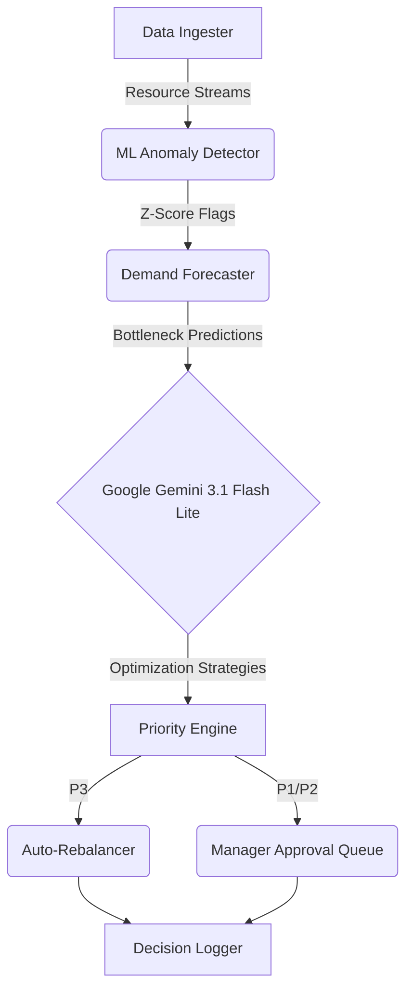

<p align="center">
  
</p>

<h1 align="center">🧠 SmartAlloc</h1>
<h3 align="center">AI-Powered Smart Resource Allocation Platform</h3>
<p align="center"><em>Using ML, Generative AI & Multi-Agent Orchestration to optimize enterprise resource distribution in real-time</em></p>

<p align="center">
  
  
  
  
  
  
</p>

---

## 📌 Problem Statement & Vision

> **Enterprises waste 30–40% of allocated resources** (compute, personnel, budget) due to manual allocation, siloed data, and reactive decision-making.

Traditional resource management suffers from:
- **Manual allocation** → 200+ hours/quarter spent on assignment reviews
- **Reactive scaling** → Bottlenecks detected after services degrade (72hr avg lag)
- **Siloed data** → Compute, HR, budget, and infrastructure data in 4+ disconnected tools
- **Slow rebalancing** → 5–7 day cycle from detection to reallocation

**SmartAlloc** solves this with an autonomous **7-agent AI pipeline** that continuously monitors, detects, predicts, and rebalances resources in under 3 seconds. It features a stunning, state-of-the-art neon green dashboard designed for maximum observability and control.

---

## 📸 UI/UX Gallery

| Overview Dashboard | Allocation Lab (Simulation) |
|:---:|:---:|
| Placeholder for `docs/screenshots/dashboard.png` | Placeholder for `docs/screenshots/simulation.png` |
| *Real-time metrics, system health, and execution triggers* | *Non-deterministic pipeline testing with live system logs* |

| Allocation Anomalies | Reallocations & Approvals |
|:---:|:---:|
| Placeholder for `docs/screenshots/anomalies.png` | Placeholder for `docs/screenshots/actions.png` |
| *ML-detected allocation inefficiencies (Z-Score > 1.8σ)* | *Human-in-the-loop (HITL) approval for P1/P2 actions* |

*(Note: Add the screenshots in `docs/screenshots/` directory for full visual presentation).*

---

## 🏗️ Architectural Overview

### LangGraph.js State Machine



### The 7 Autonomous Agents

| # | Agent Node | Role | Technology |
|---|------------|------|------------|
| 1 | **Data Ingester** | Loads resource requests + capacity metrics | Local JSON stream |
| 2 | **Allocation Analyzer** | ML-based anomaly detection (over/under-allocation) | Z-Score statistical engine |
| 3 | **Demand Forecaster** | Predicts capacity bottlenecks 24–72h ahead | Moving-average trend extrapolation |
| 4 | **Gen AI Advisor** | Natural-language optimization recommendations | Google Gemini 3.1 Flash Lite |
| 5 | **Priority Engine** | P1/P2/P3 urgency classification | Impact-weighted ranking |
| 6 | **Auto-Rebalancer** | Executes P3 optimizations, queues P1/P2 | Autonomous execution engine |
| 7 | **Decision Logger** | Immutable audit trail per run | Persistent JSON store |

---

## ✨ Enterprise-Grade Features

### 🤖 ML-Based Anomaly Detection
- Computes **per-resource-type utilization baselines** (mean + std deviation)
- Flags allocations deviating **>1.8σ** from their pool's baseline
- Detects 3 anomaly classes: `over_allocated`, `under_utilized`, `bottleneck`
- Each anomaly scored with composite Z-Score + efficiency gap

### 🔮 Demand Forecasting
- **Moving-average + trend extrapolation** on capacity snapshots
- Projects demand curves for **24–72 hour horizons**
- Identifies intersection with capacity ceilings → `bottleneck_probability`
- Outputs `hours_to_breach` and `overflow_units` per resource pool

### 🧠 Generative AI Advisor (Google Gemini)
- Powered by **Gemini 3.1 Flash Lite** for ultra-fast, structured advisory.
- Natural-language **"Why this reallocation matters"** explanations.
- **Intelligent local fallback** ensures 100% uptime for demos even if API rate limits are hit.

### ⚡ Autonomous Rebalancing
- **P3** (routine optimizations) → auto-execute instantly
- **P1/P2** (critical shifts) → routed to managers with full context
- One-click **approve/reject** workflow in the *Reallocations* dashboard

### 📊 6 Workload Scenarios (Stochastic Generator)
| Scenario | Description | Key Stress Area |
|----------|-------------|-----------------|
| `normal` | Steady-state operations | Baseline |
| `peak_sprint` | Sprint deadline crunch | High compute demand |
| `team_scaling` | Rapid hiring/scaling | Personnel allocation |
| `cloud_migration` | Infrastructure migration | Massive compute spikes |
| `product_launch` | Go-to-market surge | GPU/ML resource burst |
| `quarter_end` | Budget reconciliation | Budget consolidation |

---

## 🛠️ Tech Stack

| Layer | Technology | Purpose |
|-------|-----------|---------|
| **Orchestration** | LangGraph.js | Stateful multi-agent DAG execution |
| **Gen AI** | Google Gemini 3.1 Flash Lite | Optimization reasoning + NL recommendations |
| **ML Pipeline** | Custom TypeScript | Z-Score anomaly detection + demand forecasting |
| **Frontend** | Next.js 14 (App Router) | SSR + API routes + real-time dashboard |
| **UI** | Tailwind CSS + Framer Motion | Premium neon green UI animations |
| **Data Engine** | Custom Simulator | Stochastic workload generator (6 scenarios) |
| **Storage** | Local JSON | Zero-dependency persistent storage |
| **Language** | TypeScript (end-to-end) | Full type safety from UI to AI layer |

---

## 🚀 Quick Start & Installation

### Prerequisites
- **Node.js** 18+ 
- **npm** 9+
- (Optional) **Google Gemini API Key** — Works seamlessly without it using intelligent fallback!

### Installation

```bash
# Clone the repository
git clone https://github.com/adarshcod30/SmartAlloc.git
cd SmartAlloc

# Install dependencies
npm install

# Set up environment
cp .env.example .env
# Add your GEMINI_API_KEY to .env

# Start development server
npm run dev
```

Open **http://localhost:3000** to access the dashboard.

---

## 🧪 Pipeline Execution Guide

1. Navigate to **Allocation Lab** (`/simulation`).
2. Click **RUN PIPELINE**.
3. Watch the 7-agent orchestrator execute non-deterministically.
4. Go to **Efficiency** to see the units of resources optimized and reclaimed.
5. Check **Inefficiencies** to view ML-detected resource anomalies.
6. Check **Reallocations** to review and approve Manager Escalations.
7. Inspect the **Audit Trail** for a complete, transparent log of all agent transitions.

---

## 🌐 API Endpoints Reference

| Method | Endpoint | Description |
|--------|----------|-------------|
| `POST` | `/api/pipeline` | Triggers the full 7-agent optimization state machine |
| `GET` | `/api/runs` | Fetches history of all simulation pipeline runs |
| `GET` | `/api/metrics/:runId` | Retrieves efficiency metrics for a specific run ID |
| `GET` | `/api/audit/:runId` | Retrieves the immutable trace logs of agent steps |
| `GET` | `/api/approve` | Fetches pending reallocation actions for HITL approval |
| `POST` | `/api/approve` | Approves or rejects a given reallocation action |
| `GET` | `/api/status` | Returns system health and queue lengths |

---

<p align="center">
  <strong>Built for Hackathon 2026</strong><br/>
  <em>SmartAlloc — AI-Powered Smart Resource Allocation</em><br/>
  <sub>LangGraph.js · Google Gemini 3.1 Flash Lite · Next.js 14</sub>
</p>
